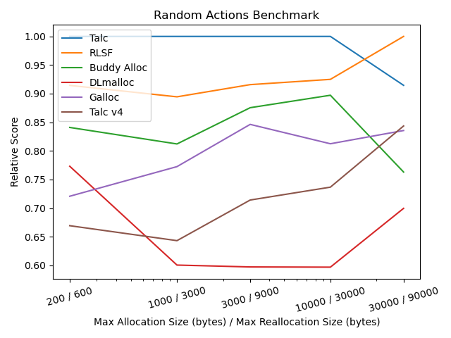
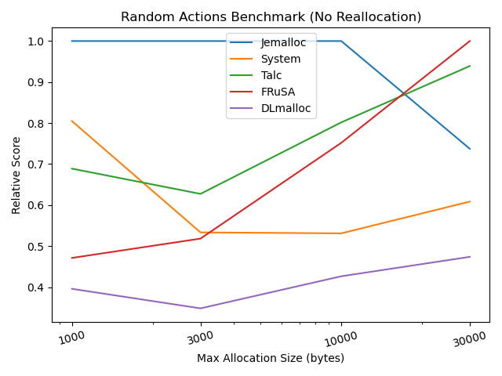
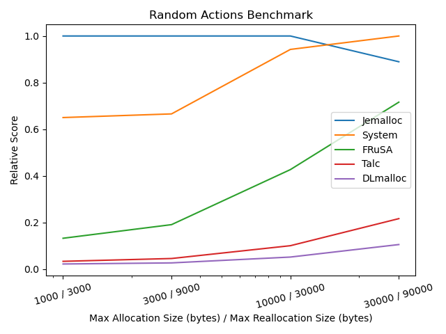
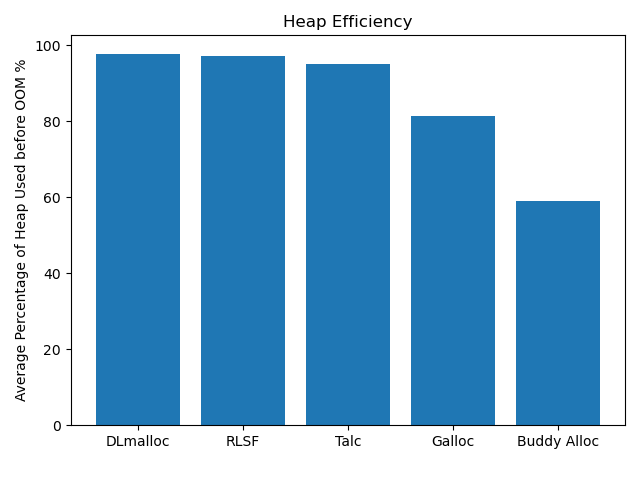
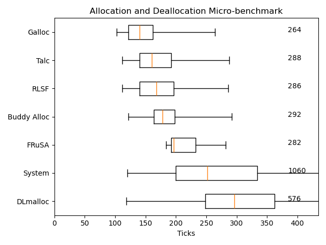

# Allocator Benchmarks

## Random Actions

### Single-threaded: Allocation, Deallocation, and Reallocation

Run with `just random-actions`. Source code can be found in `benches/src/random_actions.rs`.



### Single-threaded: Allocation and Deallocation only

Run with `just random-actions-no-realloc`. Source code can be found in `benches/src/random_actions.rs`.



### Multi-Threaded: Allocation, Deallocation, and Reallocation

Run with `just random-actions-multi`. Source code can be found in `benches/src/random_actions.rs`.



## Heap Efficiency

Run with `just heap-efficiency`. Source code can be found in `benches/src/heap_efficiency.rs`.



System and FRuSA are not shown as they aren't arena allocators and thus
my benchmarking script doesn't work on them.

FRuSA is a slab allocator that keeps pages for fixed-size chunks (powers of two)
and rounds allocation sizes up to fit them in. I expect this to have a similar
overhead to buddy allocators (which subdivides and recombines chunks in twos)
so Buddy Alloc _may_ be somewhat representative of FRuSA's memory efficiency.

## Microbench

Run with `just microbench`. Source code can be found in `benches/src/microbench.rs`.



These figures _should_ agree with single-threaded alloc+dealloc-only random actions at the 30000ish point.

It does seem to, besides Galloc. Not sure what's up with that.

## Allocators not included here

`System` is Rust's `std::alloc::System` allocator on Linux. All other OS's `System` implementations aren't shown.

`linked_list_allocator` and `simple_chunk_allocator` are not included as they are much, much
slower compared to the alternatives, making some of the plots unreadable.

Jemalloc/Mimalloc/HeapAlloc/etc. aren't included mostly because they're not alternatives to Talc.
These are allocators written for hosted systems and scale very well with multi-threaded workloads.
They don't support `no_std` or WebAssembly.
If you are doing allocation-heavy multithreaded work in a hosted environment, you absolutely should not
use Talc (and most of the allocators shown here).

## Notes

There's no good substitute for benchmarking your program with different allocators.

However, I think random actions should give you a rough idea of what to expect.
I'm a little more skeptical of the micro-benchmarks by nature, but I've included it for completeness.

There are a bunch of "hidden" choices in these benchmarks that I've consciously chosen to suite
my intuition of what seems representative of real programs, e.g. the distributions of sizes and
alignments.

For example:

```rust
// benches/src/lib.rs

/// Bias towards smaller values over larger ones.
///
/// Why not a linear distribution:
/// This concentrates most of the generated sizes around 2-3 neighboring
/// binary orders of magnitude, near the maximum.
///
/// Speculation:
/// Programs often allocate more smaller sizes than larger sizes.
///
/// Possible objection:
/// Programs may only really care about a few different orders of
/// magnitude-worth of binary orders of magnitude when it comes to
/// allocation sizes.
///
/// This could probably be improved by sampling empirical allocation data or something.
pub fn generate_size(max: usize) -> usize {
    let cap = fastrand::usize(16..max);
    fastrand::usize(4..cap)
}

/// Strongly bias towards low alignment requirements.
///
/// Most allocations don't need alignment any higher than the system pointer size.
/// (e.g. malloc doesn't guarantee a higher alignment).
pub fn generate_align() -> usize {
    // 75%    align_of::<usize>
    // 19%    align_of::<usize>*2
    //  4%    align_of::<usize>*4
    //  0.8%  align_of::<usize>*8
    //       ...
    align_of::<usize>() << fastrand::u16(..).trailing_zeros() / 2
}
```

Unsurprisingly, I've also designed Talc with these same intuitions, so in a roundabout way, the
benchmarks may be considered mildly "fitted" to Talc. If you disagree with my assumptions,
then you should take the applicability of these results with a grain of salt.

Talc v4's performance is pretty mediocre on these benchmarks. Not entirely unexpected though.
RLSF walks all over Talc v4. It was a significant impetus for writing Talc v5.
