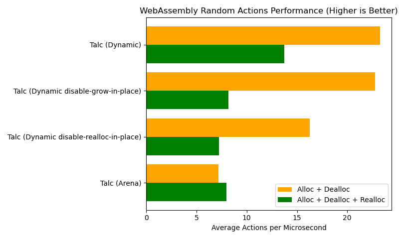
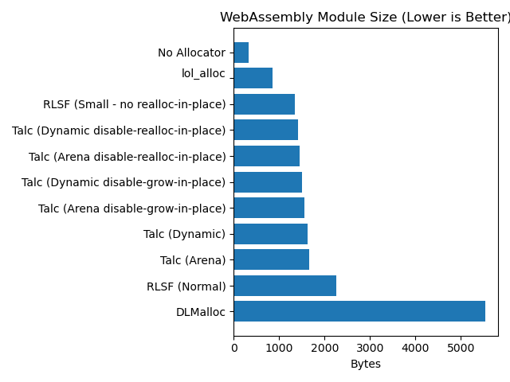

# WebAssembly Allocator Benchmarks

## Performance Benchmark

Run with `just wasm-perf`. Source code can be found in `wasm-perf/`.



## Size Benchmark

Run with`just wasm-size`. Source code can be found in `wasm-size/`.



## Conclusions

- If all you care about is WebAssembly module size, use `lol_alloc`
- If all you care about is performance, use `Talc`
- If you want a "best of both worlds" then use `Talc` (consider setting `"disable-realloc-in-place"` or `"disable-grow-in-place"`), or RLSF's `SmallGlobalTlsf`.

- `DLmalloc` and RLSF's `GlobalTlsf` are worse in both size and performance to `Talc`.

## Caveats

`Talc`'s default WebAssembly configuration is less memory-efficient compared to the alternatives. The defaults are chosen as WebAssembly modules rarely push the limits of system memory, whereas network bandwidth and runtime performance dictate the latency end-users experience, and therefore is often crucial.

_(TODO, check if this still holds up for `WasmGrowAndExtend` - this was evaluated with `WasmGrowAndClaim`.)_ Expect a 10%-15% higher runtime memory usage, though I've only taken rough measurements. Your mileage may vary. To test for yourself, you can use `core::arch::wasm32::memory_size::<0>()` to see how much memory the WebAssembly module is using.

`Talc`'s memory efficiency is mostly dependent on the `Binning` configuration used. You can swap out `WasmBinning` if desirable.

Using `WasmGrowAndExtend` instead of `WasmGrowAndClaim` will also help.

#### `WasmGrowAndExtend` vs. `WasmGrowAndClaim`

By default, Talc extends the arena to new WebAssembly pages on demand using the `WasmGrowAndExtend` OOM handler.

An alternative to consider is `WasmGrowAndClaim`:
- Claims new heaps instead of extending the existing one. This increases memory fragmentation, see https://github.com/SFBdragon/talc/issues/51
- Requires ~97 less bytes of WebAssembly module size due to avoiding pulling in the `Talc::extend` code.

```rust
use talc::{wasm::*, cell::TalcSyncCell};

#[cfg(all(not(target_feature = "atomics"), target_family = "wasm"))]
#[global_allocator]
static TALC: TalcSyncCell<WasmGrowAndClaim, WasmBinning> = TalcSyncCell::new_wasm(WasmGrowAndClaim);
```
