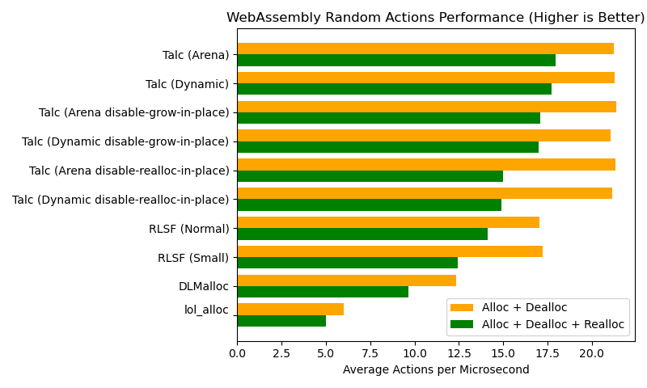

# WebAssembly Allocator Benchmarks

## Performance Benchmark

Run with `just wasm-perf`. Source code can be found in `wasm-perf/`.



## Size Benchmark

Run with`just wasm-size`. Source code can be found in `wasm-size/`.


## Conclusions

- If all you care about is WebAssembly module size, use `lol_alloc`
- If all you care about is performance, use `Talc`
- If you want a "best of both worlds" then use `Talc` (consider setting `"disable-realloc-in-place"` or `"disable-grow-in-place"`), or RLSF's `SmallGlobalTlsf`.

- `DLmalloc` and RLSF's `GlobalTlsf` are worse in both size and performance to `Talc

## Caveats

`Talc`'s default WebAssembly configuration is less memory-efficient compared to the alternatives. The defaults are chosen as WebAssembly module's rarely push the limits of system memory, whereas network bandwidth and runtime performance dictate the latency end-users experience, and therefore is often crucial.

Expect a 10%-15% higher runtime memory usage, though I've only taken rough measurements. Your mileage may vary. To test for yourself, you can use `core::arch::wasm32::memory_size::<0>()` to see how much memory the WebAssembly module is using.

`Talc`'s memory efficiency is almost entirely dependent on the `Binning` configuration used. You can swap out `WasmBinning` if desirable.

Using `ExtendWasmMemOnOom` instead of `ClaimWasmMemOnOom` will also help. 

#### `ClaimWasmMemOnOom` vs. `ExtendWasmMemOnOom`

By default, Talc claims new WebAssembly pages on demand using the `ClaimWasmMemOnOom` OOM handler.

An alternative to consider is `ExtendWasmMemOnOom`:
- Extends the arena instead of claiming new arenas. This reduces memory fragmentation and thus may improve memory efficiency somewhat.
- Requires ~250 more bytes of WebAssembly module size due to pulling in the `Talc::extend` code.

```rust
use talc::{wasm::{ExtendWasmMemOnOom, WasmBinning}, cell::{TalcCell, TalcCellAssumeSingleThreaded}};

// SAFETY: The runtime environment must be single-threaded WASM.
#[global_allocator]
static TALC: TalcCellAssumeSingleThreaded<WasmBinning, ExtendWasmMemOnOom> = unsafe {
    TalcCellAssumeSingleThreaded::new(TalcCell::new(ExtendWasmMemOnOom::new()))
};
```
